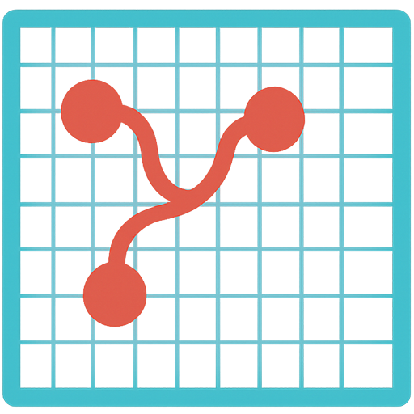
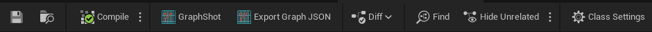
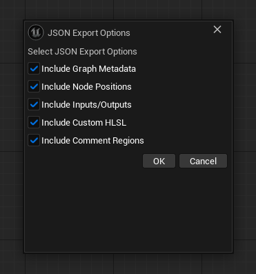

<h1>
    
    <strong>UE5_GraphCapture</strong>
</h1>

UE5_GraphCapture is an Unreal Engine 5 editor plugin that allows you to take high-quality screenshots of graph editors (such as Blueprint, Material, Behavior Tree, and AI Graphs) directly from the UE5 editor. It also lets you export the structure of these graphs to JSON for documentation, analysis, or automation.

## Features

- Capture screenshots of selected nodes or entire graph editors.
- Export the structure of Blueprint, Material, Behavior Tree, and AI Graphs to JSON.
- Choose which graph details to include in the JSON (metadata, node positions, pins, custom HLSL, comment regions).
- Integrates with the UE5 editor toolbar and menu for easy access.
- Provides notifications with clickable links to saved screenshots and export files.
- Supports screenshots up to **16200x16200** pixels (max resolution, may depend on GPU/OS).

## Installation

1. Copy the `UE5_GraphCapture` folder into your project's `Plugins` directory:
   `YourProject/Plugins/UE5_GraphCapture`
2. Regenerate project files and open your project in Unreal Engine 5.
3. Enable the plugin in the Plugins window if it is not already enabled.
4. Restart the editor if prompted.

## Building on Linux

To build your Unreal Engine project with this plugin on Linux, use the following commands (replace `<YourProjectName>` and `<YourProjectPath>` with your actual project name and path):

```sh
cd <UnrealEngineDir>/Engine/Build/BatchFiles/Linux
./Build.sh <YourProjectName>Editor Linux Development <YourProjectPath>/<YourProjectName>.uproject
```

## Usage

1. Open any supported graph editor (Blueprint, Material, etc.).
2. **To take a screenshot:**  
Select the nodes you want to capture, or CTRL+A to capture the entire graph. Zoom to 1:1 and make sure the left-most (starting nodes) are visible. Use the "GraphShot" button in the toolbar or menu to take a screenshot.
<p align="center">
    
</p>

3. **To export graph as JSON:**
Click the "Export Graph JSON" button to export the graph as JSON.
When exporting, choose which details to include in the dialog that appears, then confirm.<br>
<p align="center">
    
</p>

A notification will appear with a link to the saved screenshot or JSON file.

## Output Locations

- **Screenshots:**  
  `[YourProject]/Saved/Screenshots/UE5_GraphCapture/`
- **JSON exports:**  
  `[YourProject]/Saved/GraphExport.json`

## Sample JSON Output

```json
{
  "graphType": "NiagaraGraph",
  "schemaName": "EdGraphSchema_Niagara",
  "nodes": [
    {
      "id": "EmitterSpawn_0",
      "type": "NiagaraNodeOp",
      "posX": 100,
      "posY": 200,
      "inputs": ["SpawnCount"],
      "outputs": ["SpawnedParticles"]
    },
    {
      "id": "NiagaraNodeCustomHlsl_1",
      "type": "NiagaraNodeCustomHlsl",
      "posX": 300,
      "posY": 220,
      "customHlsl": "VelocityOut = ...;",
      "inputs": ["ParticleReader"],
      "outputs": ["VelocityOut"]
    }
  ],
  "links": [
    {
      "fromNode": "EmitterSpawn_0",
      "fromPin": "SpawnedParticles",
      "toNode": "NiagaraNodeCustomHlsl_1",
      "toPin":   "ParticleReader"
    }
  ],
  "regions": [
    {
      "name": "Spawn Logic",
      "nodeIds": ["EmitterSpawn_0", "...", "..."]
    },
    {
      "name": "Velocity Integration",
      "nodeIds": ["NiagaraNodeCustomHlsl_1", "...", "..."]
    }
  ]
}
```

## Development

- Written in C++ using Unreal Engine 5's editor extension APIs.
- No external dependencies required.

## License

This project is licensed under the MIT License. See the [LICENSE](LICENSE) file for details.